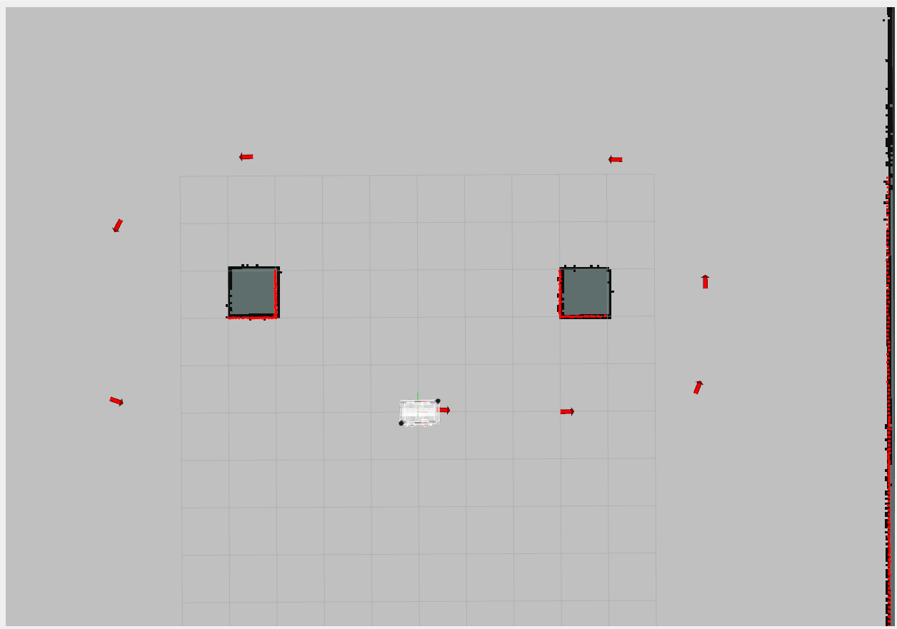
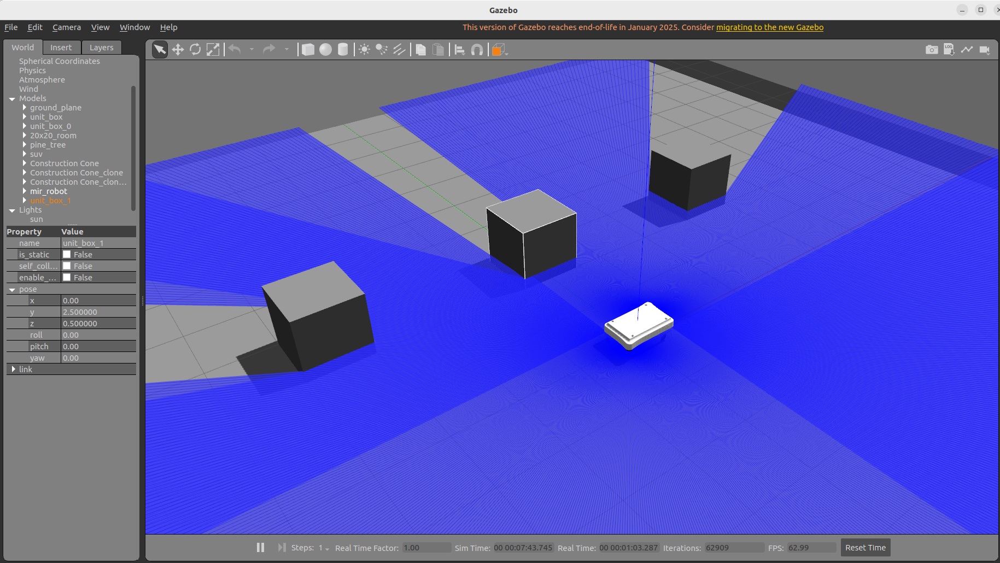
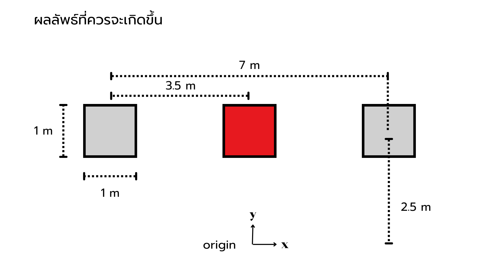

# OpenTopic_mapping_simulation

## create your workspace
```
cd
mkdir mappig_ws && cd mapping_ws
```

### clone this repository
```
git clone ...
```
```
cd ~/mapping_ws/

# Clone mir_robot into the ROS2 workspace
git clone -b humble-devel https://github.com/relffok/mir_robot src/mir_robot

# Fetch linked repositories using vcs
vcs import < src/mir_robot/ros2.repos src --recursive

# Install dependencies using rosdep (including ROS)
sudo apt update
sudo apt install -y python3-rosdep
rosdep update --rosdistro=humble
rosdep install --from-paths src --ignore-src -r -y --rosdistro humble

# Build all packages in the workspace
cd ~/mapping_ws
colcon build
```


```
ros2 launch slam_toolbox online_async_launch.py slam_params_file:=/home/chayanin09/open_topic/src/OpenTopic_mapping_simulation/robot_slam_toolbox/config/mapper_params_online_async.yaml
```
### รูปแบบของไฟล์ map ของ slam-toolbox
| ประเภทไฟล์       | ใช้ทำอะไร |
|------------------|------------|
| **Occupancy Grid** | `.pgm` (ภาพ) + `.yaml` (metadata) — ใช้สำหรับ Nav2 และ map_server |
| **Pose Graph**     | `.posegraph` — เก็บข้อมูลกราฟ SLAM เพื่อโหลดมาต่อ mapping หรือ localization ต่อ |
| **Full State**     | `.data` — บันทึก state ทั้งหมด (nodes, constraints, metadata) สำหรับโหลดระบบคืนทั้งหมด |


## 🛠 Prerequisites
- ROS 2 Humble (หรือเวอร์ชันที่ใช้จริง)  
- slam_toolbox from `ros2` branch  
- Gazebo Classic + ROS 2 control 

## robustness experimetn
วัตถุประสงค์:
เพื่อประเมินความสามารถของระบบในการคงประสิทธิภาพการทำงาน ภายใต้สภาวะที่มีการรบกวน (Noise) หรือความไม่แน่นอน (Uncertainty) ที่ถูกแทรกเข้าไปในสัญญาณต่าง ๆ ของระบบเซนเซอร์, การประมาณตำแหน่ง


## scenario A 
ปัญหา: noise ของ lidar มี่ผลต่อการอัพเดดอุปสรรคใหม่ หรือไม่
สมมุติฐาน: noise ของ lidar มีผลต่อ ขนาดของอุปสรรค
ตัวต้น: ความแปรปรวน ของ laserscan
ัตัวแปรตาม: map ที่ผ่านการอัพเดด
ตัวควบคุม: อุปสรรค เซนเซฮร์ encoder 
ขั้นตอนการทดลอง

1. กำหนดรูปแบบการเดินของหุ่น
-


2. เซ็ท object ที่ต้องการอัพเดด ลงไปใน map
ตำแหน่งของ อุปสรรค ใหม่ คือ กล่องลูกบาศก์ ขนาด 1x1x1 เมตร 
อยู่ที่ตำแหน่ง
    - x: 0.0  
    - y: 2.5 


3. replay การเดินของหุ่น พร้อมปรับ ค่า noise 

คำสั่ง บันทึก topic
```
ros2 bag record -o ~/Documents/slam_ws/bags/slam_replay /tf /tf_static /scan /odom /clock
```

คำสั่งเล่นซ้ำ topic
```
ros2 bag play ~/Documents/slam_ws/bags/slam_replay
```

ros2 service call /slam_toolbox/save_map slam_toolbox/srv/SaveMap "name:
  data: 'ex1_obj_0v01_attemp1'" 

ros2 run tf2_ros static_transform_publisher 0 0 0 0 0 0 map gt_odom
ros2 run tf2_ros static_transform_publisher 0 0 0 0 0 0 map odom
